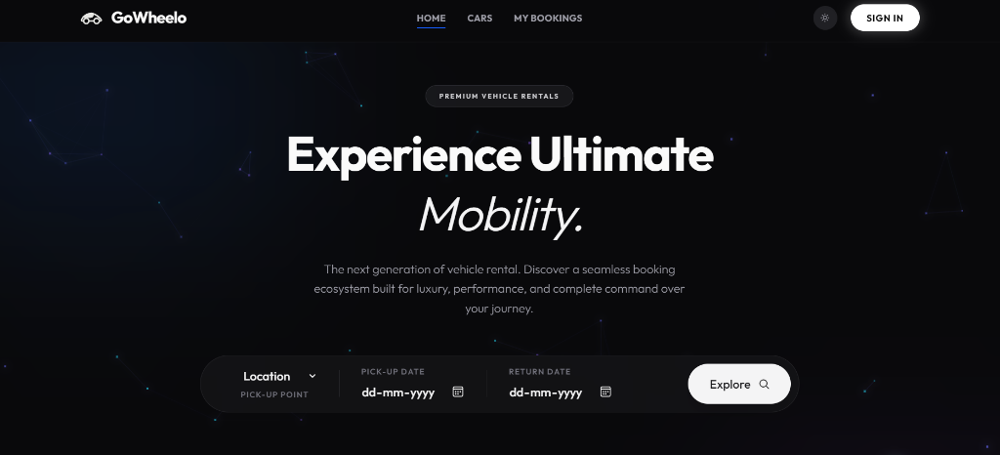

# 🏎️ GoWheelo - Premium Peer-to-Peer Car Rental Platform



> The next-generation peer-to-peer car rental ecosystem. Discover, rent, and manage premium vehicles with an advanced command center and live chat features.

---

## 🛠️ Tech Stack

### Frontend (Client)
* **React 18** (Vite-powered SPA)
* **Tailwind CSS** (Modern utility-first styling with sleek Glassmorphism and Dark Mode support)
* **Framer Motion & GSAP** (High-fidelity micro-interactions and smooth page transitions)
* **React Router DOM** (Declarative client-side routing)
* **Axios** (API requests with credentials support)
* **Socket.io Client** (Websocket connection for instant messaging)
* **Qrcode.react** (On-the-fly generation of payment QR codes)

### Backend (Server)
* **Node.js & Express.js** (Robust REST API and Websocket server)
* **MongoDB & Mongoose** (NoSQL Database & Object Data Modeling)
* **Socket.io** (Real-time bi-directional messaging)
* **JSON Web Tokens (JWT)** (Stateless, cookie-based authentication)
* **Brevo HTTP API Client** (Secure transactional email delivery)

---

## ✨ Features

### 🌟 High-Fidelity Premium UI
* Implements a state-of-the-art dark/light mode toggle with modern typography.
* Smooth hover states, premium cards, and responsive layouts customized for desktops and mobile devices.

### 🛡️ Ironclad Auth & OTP Verification
* Secure signups require verifying a timed, auto-expiring 6-digit PIN sent via email.
* Passwords are encrypted using high-performance one-way hashing (**Bcrypt**).

### 💬 Live Real-Time Chat
* Buyers/renters can text hosts directly regarding vehicle details.
* Built using a custom Socket.io implementation that updates instantly without reloading.

### 📅 Smart Availability & Booking Engine
* Live collision detection ensures dates cannot be double-booked.
* Fully interactive bookings calendar showing available slots.

### 💼 Host / Owner Command Center
* Add and list new vehicles to the fleet.
* View and manage current bookings.
* Accept or decline pending booking requests.
* Delete vehicle listings safely with single-click actions.

### 💳 Interactive Hybrid Checkout
* Simulates real-world checkouts.
* Dynamically generated UPI QR codes allowing mock payments alongside standard card entries.
* Live currency conversion (USD/INR).

---

## ⚙️ Installation & Setup

### Prerequisites
* Node.js (v18+)
* MongoDB Connection String (Local or Atlas)
* Brevo API Key (for sending verification emails)

### 1. Clone the repository
```bash
git clone https://github.com/yourusername/gowheelo.git
cd car_rental
```

### 2. Configure Backend
```bash
cd server
npm install
```
Create a `.env` file in the `server` directory:
```env
PORT=8001
MONGODB_URI=your_mongodb_connection_string
JWT_SECRET=your_jwt_secret
GMAIL_USER=your_gmail_for_sender_display@gmail.com
BREVO_API_KEY=your_brevo_xkeysib_api_key
```
Start the backend server:
```bash
npm run dev
```

### 3. Configure Frontend
```bash
cd ../client
npm install
```
Create a `.env` file in the `client` directory:
```env
VITE_API_URL=https://go-wheelo-backend.onrender.com
VITE_CURRENCY=$
```
Start the frontend dev server:
```bash
npm run dev
```

---

## ⚡ Technical Challenges & Solutions

### 1. Render SMTP Port Block (Gmail Timeout)
* **Challenge:** Render's network firewall completely blocks standard SMTP ports (25, 465, and 587) on its Free tier. Standard Nodemailer configurations with Gmail timed out indefinitely.
* **Solution:** Migrated the email service to use the **Brevo (formerly Sendinblue) REST HTTP API** over secure port 443 (HTTPS), bypassing SMTP restrictions entirely.

### 2. Resend Free Tier Restrictions
* **Challenge:** Resend was evaluated as an alternative, but its free tier restricts sending emails only to the account owner's address unless a custom domain is verified.
* **Solution:** Implemented the Brevo API client which supports sending verification OTPs to any destination email address right out of the box.

### 3. Socket.io Handshake Drops on Render Free Tier
* **Challenge:** Render's routing proxy/load balancer lacks session affinity (sticky sessions) on its Free tier, causing the initial HTTP-polling handshakes of Socket.io to drop and throw `Session ID unknown` errors. Additionally, transient network drops or server restarts wiped out room memberships in memory.
* **Solution:** 
  1. Configured the Socket.io client to connect directly via pure WebSockets (`transports: ["websocket"]`), bypassing polling completely.
  2. Implemented a listener on the `"connect"` event on the client to automatically re-emit the `join_conversation` event upon reconnection, re-entering the active chat room seamlessly.

### 4. Mongoose v9 `.remove()` Deprecation Crash
* **Challenge:** In Mongoose v9, the `.remove()` method on documents was removed. Calling it from the Owner's vehicle deletion endpoint crashed the server.
* **Solution:** Refactored the deletion handler to use the modern, safe Mongoose query helper `Car.findByIdAndDelete(carId)`.

### 5. Netlify SPA Sub-page Reload 404s
* **Challenge:** When reloading pages like `/signup` or `/dashboard` on Netlify, the server threw 404 errors because Netlify acts as a static host and cannot resolve sub-routes on its own.
* **Solution:** Added a `_redirects` file to the `client/public` folder with the redirect rule: `/* /index.html 200`. This instructs Netlify to route all incoming traffic back to the single-page entry point (`index.html`), letting React Router handle routing.
